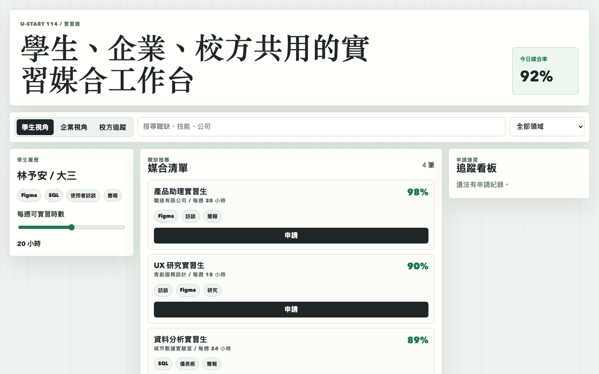
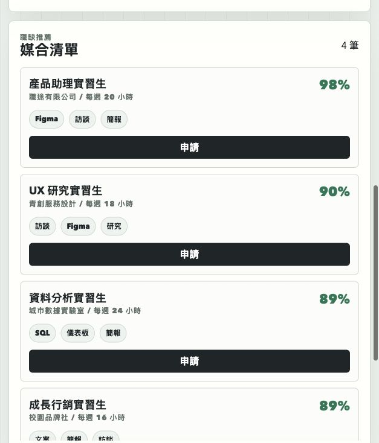

# 實習通原型

## 快速看懂

- 線上 Demo：https://atlasforcn.github.io/startup-internship-match/
- 這個原型在做什麼：把實習通做成學生與企業的實習媒合管理平台。
- 特色定位：特色是聚焦申請流程、媒合分數與面試進度，而不是一般職缺列表。
- 操作流程：瀏覽實習職缺與技能需求 → 查看學生/企業媒合程度 → 管理投遞、面試與錄取流程

展開完整功能流程截圖

## 比賽來源

- 競賽：U-start 創新創業計畫
- 屆次：114 年度第二階段績優團隊
- 得獎作品：實習通
- 學校：國立政治大學
- 公司：職途有限公司
- 類別：創新服務
- 官方來源：https://ustart.yda.gov.tw/p/405-1000-2178,c147.php?Lang=zh-tw

## 核心概念

依公開名稱「實習通」理解，本原型把作品概念實作為學生、企業與校方共用的實習媒合平台。核心是技能履歷、職缺條件、媒合分數、申請進度與校方追蹤。

## 功能

- 學生、企業、校方三種視角
- 職缺搜尋與領域篩選
- 依技能與可實習時數計算媒合分數
- 申請、邀請面試、校方追蹤的流程看板

## 聲明

本 repo 是依官方公開得獎名稱建立的概念原型，不代表原團隊授權產品，也未使用原團隊商標、素材或未公開資料。

## 8 位專家補強

- 使用者與痛點：學生需要可信職缺與申請進度，企業需要降低履歷篩選與實習管理成本。
- 市場與差異：替代方案是求職網站、校內表單與人工作業；差異在校方驗證、能力證據與實習期間回饋。早期客群從單一科系與合作企業導入，採購者為學校或企業。
- 驗證：以場域試辦的職缺轉換、面試率、錄取率、到職率、完訓紀錄、雙方回饋與留任成效指標判斷。
- 商業模式：企業依職缺或年度方案付費，學校採訂閱或導入報價；收入、招募成本、客服成本與毛利需隨成交漏斗驗證。
